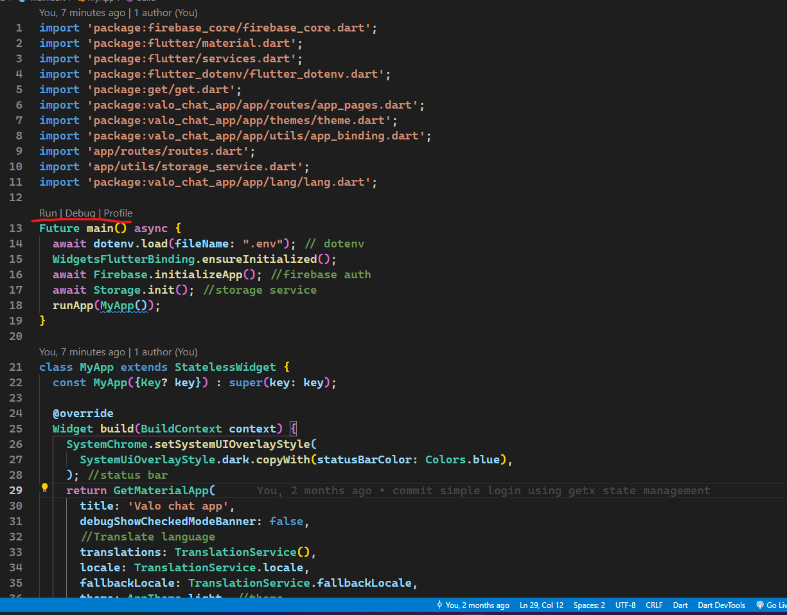

# valo_chat_app
Môn Công nghệ Mới
Nhóm 23: Valo chat app 

## Cài chương trình
Cài đặt flutter library:
Theo hướng dẫn: https://docs.flutter.dev/get-started/install

Chạy bằng Android Studio hoặc VS code (Cài extentions/plugin Flutter,Dart)

## Chạy chương trình
-----------
- Kiểm tra phiên bản trước khi chạy
`flutter doctor -v`

`flutter pub get`
- Chạy bằng terminal

`flutter run`

- Chạy ở main.dart

## Các lỗi có thể gặp 

